<div align="center">

<!-- 3D Animated Banner — clickable -->
<a href="https://mabdullahab614-alt.github.io/chessmaster/">

</a>

<br/>

<!-- Animated typing subtitle — clickable -->
<a href="https://mabdullahab614-alt.github.io/chessmaster/">

</a>

<br/><br/>

<!-- 3D Play Button Badge -->
<a href="https://mabdullahab614-alt.github.io/chessmaster/">

</a>

<br/><br/>

<!-- Stat badges row 1 — all clickable -->
<a href="https://mabdullahab614-alt.github.io/chessmaster/"></a>
&nbsp;
<a href="https://mabdullahab614-alt.github.io/chessmaster/"></a>
&nbsp;
<a href="https://github.com/mabdullahab614-alt/chessmaster/blob/main/LICENSE"></a>

<br/><br/>

<!-- Stat badges row 2 — all clickable -->
<a href="https://mabdullahab614-alt.github.io/chessmaster/"></a>
&nbsp;
<a href="https://mabdullahab614-alt.github.io/chessmaster/"></a>
&nbsp;
<a href="https://mabdullahab614-alt.github.io/chessmaster/"></a>
&nbsp;
<a href="https://mabdullahab614-alt.github.io/chessmaster/"></a>

</div>

---


<br/>

<div align="center">

## 🤖 AI ENGINE ARCHITECTURE

```
╔══════════════════════════════════════════════════════════════════╗
║                    CHESSMASTER AI ENGINE                         ║
╠══════════════════════════════════════════════════════════════════╣
║                                                                  ║
║   INPUT: Board Position (FEN)                                    ║
║      │                                                           ║
║      ▼                                                           ║
║   ┌─────────────────────┐                                        ║
║   │   Opening Book      │ ──► 20+ real positions                 ║
║   │   (first 20 moves)  │     Ruy Lopez, Sicilian,               ║
║   └─────────────────────┘     Queen's Gambit...                  ║
║      │ (after book)                                              ║
║      ▼                                                           ║
║   ┌─────────────────────────────────────────┐                    ║
║   │          MINIMAX ALGORITHM              │                    ║
║   │   with Alpha-Beta Pruning (α-β)         │                    ║
║   │                                         │                    ║
║   │   Depth 1 → Beginner  (~400 ELO)        │                    ║
║   │   Depth 2 → Easy      (~800 ELO)        │                    ║
║   │   Depth 3 → Medium    (~1400 ELO)       │                    ║
║   │   Depth 4 → Hard      (~2000 ELO)       │                    ║
║   │   Depth 5 → Master    (~2800 ELO)       │                    ║
║   └─────────────────────────────────────────┘                    ║
║      │                                                           ║
║      ▼                                                           ║
║   ┌─────────────────────────────────────────┐                    ║
║   │       POSITION EVALUATION               │                    ║
║   │   • Material values (P=1 N=3 B=3 R=5)  │                    ║
║   │   • Piece-Square Tables (PST)           │                    ║
║   │   • Center control bonus               │                    ║
║   │   • King safety evaluation             │                    ║
║   │   • Mobility scoring                   │                    ║
║   └─────────────────────────────────────────┘                    ║
║      │                                                           ║
║      ▼                                                           ║
║   OUTPUT: Best Move SAN + Evaluation Score                       ║
║                                                                  ║
║   ⚡ Runs in Web Worker — NEVER blocks the UI                    ║
╚══════════════════════════════════════════════════════════════════╝
```

</div>

---


## ✨ Features

<table>
<tr>
<td width="50%">

### 🤖 Intelligence
- ✅ Real **Minimax** + Alpha-Beta Pruning
- ✅ **Piece-Square Tables** (positional eval)
- ✅ **Opening Book** — 30+ positions
- ✅ **5 Difficulty Levels** (400→2800 ELO)
- ✅ **Web Worker** — never freezes UI
- ✅ Worker **pre-warms** on load

### 🎮 Controls
- ✅ **1-Click Moves** — instant play
- ✅ **Drag & Drop** pieces
- ✅ **Touch Support** — mobile ready
- ✅ **Smart Disambiguation** (purple flash)

</td>
<td width="50%">

### 📊 Analysis
- ✅ **Live Evaluation Bar** (±score)
- ✅ **Captured Pieces** + material count
- ✅ **Move Navigation** ⏮◀●▶⏭
- ✅ **ELO Rating** — persists across games
- ✅ **W/L/D Stats** stored in browser
- ✅ **PGN Export** — one click copy

### 🎨 Experience
- ✅ **5 Board Themes** (Dark/Green/Blue/Wood/Mono)
- ✅ **Sound Effects** — all 7 types
- ✅ **Check Highlight** (pulsing red king)
- ✅ **Hint System** (gold highlight)
- ✅ **Time Controls** (Bullet→Unlimited)
- ✅ **Clickable Move History**

</td>
</tr>
</table>

---


## 🚀 Live Demo

<div align="center">

### 🌐 [https://mabdullahab614-alt.github.io/chessmaster/](https://mabdullahab614-alt.github.io/chessmaster/)

*Open in browser — works instantly, no login, no download*

</div>

---

## 🛠 Tech Stack

<div align="center">

|  | Technology | Purpose |
|--|-----------|---------|
| 🧠 | **chess.js** (CDN) | Chess rules, move validation, PGN |
| ⚡ | **Web Worker** | Non-blocking AI computation |
| 🔊 | **Web Audio API** | Synthesized sound effects |
| 💾 | **localStorage** | ELO & stats persistence |
| 👆 | **Pointer Events API** | Drag & drop + touch |
| 🎨 | **CSS Custom Properties** | 5 live board themes |
| 0️⃣ | **Zero dependencies** | No npm, no build step |

</div>

---

## ⚡ Run Locally

```bash
# Clone
git clone https://github.com/mabdullahab614-alt/chessmaster.git
cd chessmaster

# Serve (Python)
python -m http.server 8888
# → http://localhost:8888
```

> Or just double-click `index.html` — it works!

---

## 🏆 Rating

<div align="center">

| Category | Score |
|----------|-------|
| Chess Rules | ⭐⭐⭐⭐⭐ |
| AI Engine | ⭐⭐⭐⭐⭐ |
| Visual Design | ⭐⭐⭐⭐⭐ |
| Sound Effects | ⭐⭐⭐⭐⭐ |
| Mobile Support | ⭐⭐⭐⭐⭐ |
| Features | ⭐⭐⭐⭐⭐ |
| **OVERALL** | **⭐⭐⭐⭐⭐ 10/10** |

</div>

---

## 📜 License

**MIT License** — © 2026 Abdullah Javid

Free to use, modify, and distribute with attribution.

---


<div align="center">

<a href="https://mabdullahab614-alt.github.io/chessmaster/">

</a>

<br/><br/>

<a href="https://github.com/mabdullahab614-alt"></a>
&nbsp;
<a href="https://mabdullahab614-alt.github.io/chessmaster/"></a>
&nbsp;
<a href="https://github.com/mabdullahab614-alt/chessmaster/stargazers"></a>

<br/>

**⭐ Star this repo if you enjoyed playing!**

</div>
